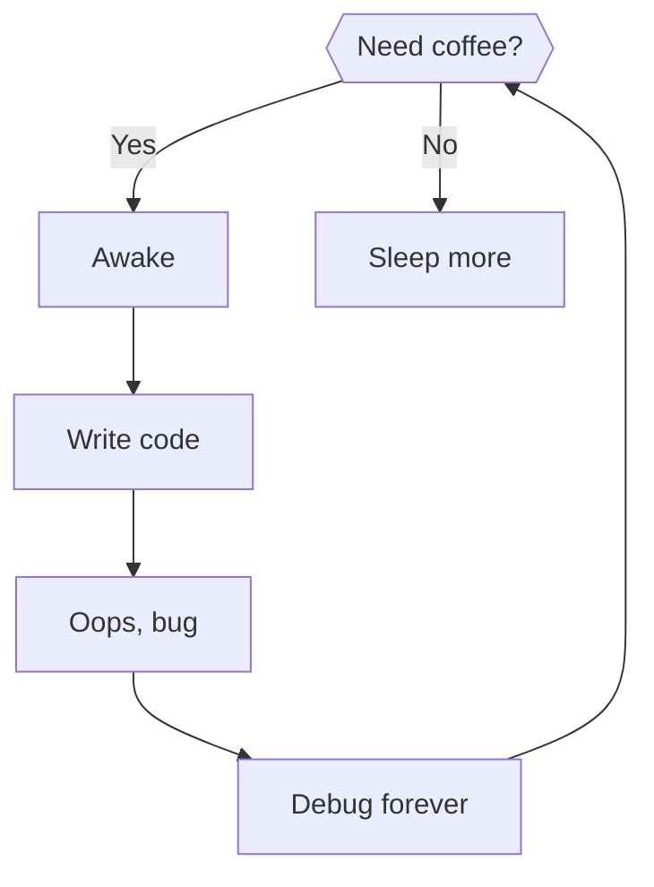

# Trello Mermaid Renderer

Render Mermaid diagrams directly inside Trello. This Trello Power-Up auto-detects Mermaid fenced code blocks in card descriptions and renders interactive SVG diagrams (flowcharts, sequence, class, state, ER, and Gantt) with zoom, pan, and fullscreen controls. No server or database—everything runs client-side using mermaid.js.

  
    ___ 
  

## Table of Contents

- [Overview](#overview)
- [Live Links](#live-links)
- [Features](#features)
- [Supported Diagram Types](#supported-diagram-types)
- [Use Cases](#use-cases)
- [Privacy & Data](#privacy--data)
- [FAQ](#faq)
- [License](#license)

## Overview

- Trello Power-Up that detects `mermaid` fenced code blocks (`mermaid ...`) in card descriptions and renders them as SVG diagrams.
- Provides a card-back section with per‑diagram controls, zoom/pan, a right‑aligned "Show source" toggle, and a fullscreen view using Trello’s modal when available.
- Includes optional settings to override the Mermaid CDN URL.

## Live Links

- [Site (GitHub Pages)](https://f1nder.github.io/trello-mermaid/src/)
- [Privacy Policy](https://f1nder.github.io/trello-mermaid/src/privacy.html)
- [Manifest](https://f1nder.github.io/trello-mermaid/src/manifest.json)

## Features

- Card badges show the number of Mermaid blocks on a card.
- Card-back section renders all Mermaid diagrams with titles parsed from Markdown headings.
- Zoom/pan controls on each diagram; scrollable source view with themed background.
- Fullscreen modal: uses Trello’s native modal (fullscreen) with a fallback custom overlay.
- Settings modal to override Mermaid CDN per board.

## Supported Diagram Types

- Flowchart (LR/TD)
- Sequence diagram
- Class diagram
- State diagram
- Entity-Relationship (ER) diagram
- Gantt chart
- etc..

Powered by [mermaid.js](https://mermaid.js.org/)

## Use Cases

- Visualize workflows, sprints, and review states as flowcharts in Trello.
- Share architecture sketches (sequence/class/ER) without leaving the board.
- Plan timelines with lightweight Gantt diagrams in descriptions.

Works with standard Trello features; no external editor required.

## Example

A tongue‑in‑cheek flowchart you can paste into a Trello card description:

## Privacy & Data

- See the [privacy policy](https://f1nder.github.io/trello-mermaid/src/privacy.html).
- This Power-Up does not store or transmit your Trello data to a custom backend. Rendering occurs client-side using Mermaid.

## FAQ

How do I render Mermaid in Trello?

Install this Power‑Up using the manifest URL above, then add a fenced code block labeled `mermaid` in any card description. The diagram renders on the card back.

Does the Power‑Up upload my diagrams to a server?

No. Rendering occurs in the browser using mermaid.js. There is no custom backend.

Is this free to use?

Yes. It’s a static Power‑Up hosted on GitHub Pages.

## License

This project is provided under the repository’s license. See the LICENSE file if present.
