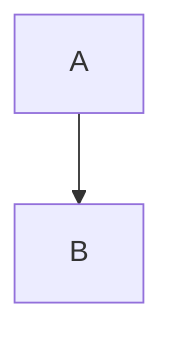

Mermaid Renderer Trello Power-Up
================================

Renders Mermaid diagrams declared in card descriptions using fenced code blocks:

```markdown

```

Files
-----

- `trello-mermaid/manifest.json` – Trello Power-Up manifest
- `trello-mermaid/index.html` – connector page + client registration
- `trello-mermaid/client.js` – capabilities: card badges + card back section
- `trello-mermaid/section.html` – iframe that renders diagrams
- `trello-mermaid/section.js` – loads Mermaid and renders blocks
- `trello-mermaid/styles.css` – basic styles
- `trello-mermaid/settings.html` – optional settings (Mermaid CDN override)
- `trello-mermaid/icon.svg` – icon for the Power-Up

Capabilities
------------

- Card Badges: shows the count of `mermaid` code blocks in the description
- Card Back Section: embeds an iframe that renders all diagrams
- Settings: allow overriding the Mermaid CDN URL

Hosting
-------

You need to host these static files at an HTTPS URL and provide that root to Trello when creating the Power-Up. Common options:

- GitHub Pages (push to a public repo and enable Pages)
- Netlify / Vercel (drag-and-drop or connect repo)
- S3/CloudFront

Trello Setup
------------

1. Go to https://trello.com/power-ups/admin and create a new Power-Up.
2. Set the `Iframe connector URL` to the hosted `index.html`.
3. Upload or reference the icon, and save.
4. Add the Power-Up to your board and enable it.

Notes
-----

- This Power-Up searches the card description for fenced blocks matching the regex: `^```\s*mermaid\n([\s\S]*?)```$` (multiline/global), and renders each block.
- Mermaid is loaded from jsDelivr by default; you can override via the settings modal.

